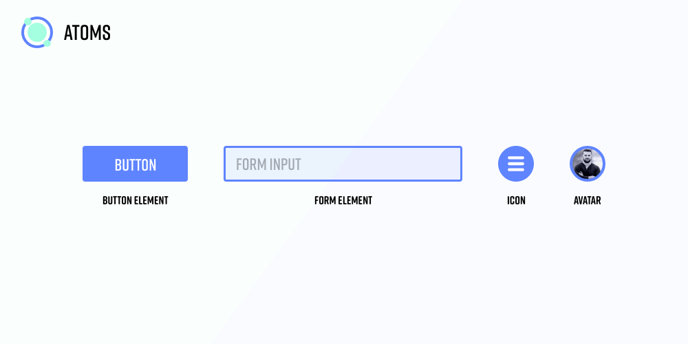
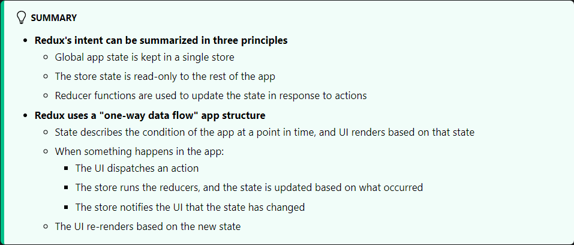

# ManSeteven
## Welcome to Crypto Universe

Source: [https://developer.tbd.website/projects/web5](https://developer.tbd.website/projects/web5/)  

## Dapps build on:

### Atomic design

Source: Base on: https://xd.adobe.com/ideas/process/ui-design/atomic-design-principles-methodology-101/

<b>Atoms:</b> Just like in Chemistry, atoms are the smallest building blocks in our system. Rather than atoms like Oxygen or Hydrogen, in design we have buttons, inputs, labels and other small elements that get used throughout our design. Iconography fits in this category, whether it is a menu icon, or avatar as they’re small elements that come together to form the next stage – molecules.

<b>Molecules:</b> In the molecule stage, we take our independent atomic design elements, each with their own characteristics, style, format, and begin to bring them together into new groupings. Take for instance our avatar atom. If we combine the avatar atom with name and title labels, other atomic elements, we can create a profile molecule. Each atom has carried its unique properties into a group that on it’s own has distinct characteristics..

<b>Organisms:</b> As we enter the Organisms stage, our collections of atoms and molecules now become more complex than at the molecular level. Take for instance our ‘profile’ molecule. It was a simple element comprising an avatar and a pair of label elements. As we bring that into an organism, we may be adding that into an app header for a profile page, complete with navigation, a background cover photo and some other molecules. This creates our header organism.

<b>Templates:</b> The template is the first stage of the Atomic Design methodology that does not align to a stage in the molecular world, but is important for Atomic Design. A template is where we begin to curate our organisms and other elements into a cohesive design.

You saw in the Organism stage that elements began forming into usable blocks of content, and those start coming together into a template of blocks that can be used across a variety of pages. Think of templates as the blueprint for our future finished page designs. At this point they’re still the elements, and won’t contain real data – much like a wireframe.

Building on our organism for the profile page, our template will now include a statistics organism showcasing some details about the profile – this could be actions taken, skill levels etc. There will also be a contact organism connected at the bottom. Using this, we now have a template for pages. This template is reusable across our application.

<b>Pages:</b> Pages are the final stage of the Atomic Design methodology. This is where instances of templates are created (in this case, one for every profile). In the design process you may not design out pages for every instance, but it is helpful to create a few variations.

As your data changes, different profile information, or languages may impact your template design. Building out to the page stage allows you to test for these variations and make adaptations globally to your templates.

It is possible in some instances you won’t use all organisms in a template, whether a user doesn’t have those enabled, or they don’t apply, in the pages is where you would adjust what parts of the template are shown.

### Redux architecture

Source: [https://redux.js.org/tutorials/fundamentals/part-2-concepts-data-flow](https://redux.js.org/tutorials/fundamentals/part-2-concepts-data-flow)  

